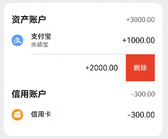
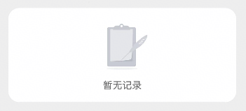
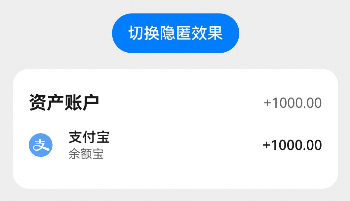
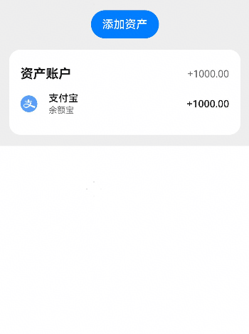
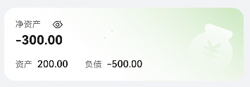
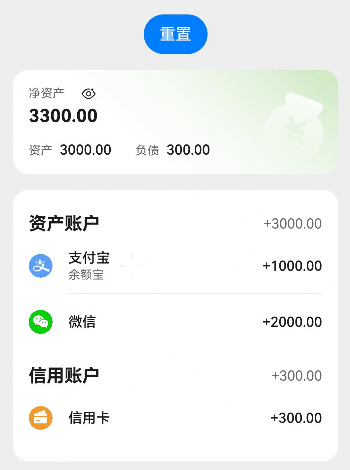

# 资产卡片组件快速入门

[toc]

## AssetCard

### 简介

本组件提供了根据传入数据，分组展示资产和负债账户卡片的能力，支持侧滑展示删除按钮，支持根据匿名参数判断是否隐匿资产信息，支持传入回调处理资产账户的点击、删除事件。


### 使用

1. 组件依赖

   由于AssetCard组件依赖**asset_base har**包，所以需要将模板根目录的components下**asset_base**目录拷贝至您的工程相应目录，拷贝完成后，在工程目录的`oh-package.json5`文件添加依赖。点击`file->Sync and Refresh Project`进行依赖安装。

   ```typescript
   // asset_card/oh-package.json5
   // AssetCard组件内部依赖情况，注意依赖路径为实际工程的相对路径
   "dependencies": {
     "asset_base": "file:../asset_base";
   }
   ```

2. 安装组件。

   ```ts
   // 在项目根目录build-profile.json5填写asset_base和asset_card路径，注意路径为实际工程的相对路径
     "modules": [
       {
         "name": "asset_base",
         "srcPath": "./asset_base",
       },
       {
         "name": "asset_card",
         "srcPath": "./asset_card",
       }
     ]
   ```

   ```typescript
   // 需要使用组件的模块/oh-package.json5 例如entry/oh-package.json5
   "dependencies": {
     "asset_card": "file:../asset_card",
     "asset_base": "file:../asset_base"
   }
   ```

3. 引入组件与相关数据结构定义

   ```ts
   import {
     AssetRecordItem,
     AssetGroupModel,
     AssetType,
     AssetCategory,
   } from 'asset_base';
   import { AssetCard } from 'asset_card';
   ```

4. 调用组件。

   ```ts
   import { AssetRecordItem, AssetGroupModel, AssetType, AssetCategory } from 'asset_base';
   import { AssetCard } from 'asset_card';

   const MOCK_FUND_LIST: AssetRecordItem[] = [
     {
       assetId: 0,
       name: '支付宝',
       icon: $r('app.media.ic_asset_4'),
       type: AssetType.FUND,
       subType: 1,
       category: AssetCategory.ASSET,
       amount: 1000,
       note: '余额宝',
     },
     {
       assetId: 0,
       name: '微信',
       icon: $r('app.media.ic_asset_5'),
       type: AssetType.FUND,
       subType: 2,
       category: AssetCategory.ASSET,
       amount: 2000,
     },
   ];

   const MOCK_CREDIT_LIST: AssetRecordItem[] = [
     {
       assetId: 0,
       name: '信用卡',
       icon: $r('app.media.ic_liability_1'),
       type: AssetType.CREDIT,
       subType: 1,
       category: AssetCategory.LIABILITY,
       amount: 300,
     },
   ];

   @Entry
   @ComponentV2
   struct PreviewPage {
     @Local
     anonymous: boolean = false;
     @Local
     assetData: AssetGroupModel = new AssetGroupModel();

     aboutToAppear(): void {
       this.assetData.fund = MOCK_FUND_LIST;
       this.assetData.credit = MOCK_CREDIT_LIST;
     }

     build() {
       Scroll() {
         Column({ space: 16 }) {
           AssetCard({
             assetData: this.assetData,
             anonymous: this.anonymous,
             handleClick: (item: AssetRecordItem) => {
               console.log('当前选中的资产账户信息如下：' + JSON.stringify(item));
             },
             handleDelete: (id: number) => {
               console.log('当前需要删除的资产id为：' + id);
             },
           });
         }
         .padding(16)
         .backgroundColor('#eee');
       };
     }
   }
   ```



### API参考

#### 子组件

无

#### 接口

AssetCard(option?:AssetCardOptions)

资产卡片组件。

**参数：**

| 参数名  | 类型                                          | 必填 | 说明                     |
| ------- | --------------------------------------------- | ---- | ------------------------ |
| options | [AssetCardOptions](#AssetCardOptions对象说明) | 否   | 配置资产卡片组件的参数。 |

#### AssetCardOptions对象说明

| 名称         | 类型                                                        | 必填 | 说明                                  |
| ------------ | ----------------------------------------------------------- | ---- | ------------------------------------- |
| assetData    | [AssetGroupModel](#AssetGroupModel对象说明)                 | 否   | 资产数据，数据格式详见AssetGroupModel |
| anonymous    | boolean                                                     | 否   | 是否为隐匿展示，默认值false           |
| handleDelete | (id: number) => void                                        | 否   | 资产账户点击删除按钮触发的回调事件    |
| handleClick  | (item: [AssetRecordItem](#AssetRecordItem对象说明)) => void | 否   | 点击资产账户触发的回调事件            |

#### AssetGroupModel对象说明

用于资产卡片展示的数据类型，当数据数组发生增加、删除、改变时，支持响应式刷新卡片界面，不支持数组内单条数据内部属性变更时刷新。

| 名称   | 类型                                          | 必填 | 说明                     |
| ------ | --------------------------------------------- | ---- | ------------------------ |
| fund   | [AssetRecordItem](#AssetRecordItem对象说明)[] | 否   | 正资产数据数组，默认为[] |
| credit | [AssetRecordItem](#AssetRecordItem对象说明)[] | 否   | 负债数据数组，默认为[]   |

#### AssetRecordItem对象说明

单条资产账户的数据类型。

| 名称     | 类型                                    | 必填 | 说明             |
| -------- | --------------------------------------- | ---- | ---------------- |
| assetId  | number                                  | 是   | 资产唯一标识符   |
| name     | string                                  | 是   | 资产名称         |
| icon     | ResourceStr                             | 是   | 图标资源路径     |
| type     | [AssetType](#AssetType枚举说明)         | 是   | 资产类型         |
| subType  | number                                  | 是   | 资产子类型       |
| category | [AssetCategory](#AssetCategory枚举说明) | 是   | 资产分类         |
| amount   | number                                  | 是   | 资产金额         |
| note     | string                                  | 否   | 备注信息         |
| isCustom | boolean                                 | 否   | 是否为自定义资产 |

#### AssetType枚举说明

用于表示资产的主类型。

| 名称   | 值  | 说明     |
| ------ | --- | -------- |
| FUND   | 1   | 资金账户 |
| CREDIT | 2   | 信用账户 |

#### AssetCategory枚举说明

表示资产的分类，用于区分资产和负债类别。

| 名称      | 值  | 说明                       |
| --------- | --- | -------------------------- |
| ASSET     | 1   | 资产，在净资产计算中为正值 |
| LIABILITY | 2   | 负债，在净资产计算中为负值 |

### 示例代码

#### 示例1 （不传入资产数据时展示空数据占位图）

```ts
import { AssetCard } from 'asset_card';

@Entry
@ComponentV2
struct AssetCardExample1 {
  build() {
    Column(){
      AssetCard();
    }
    .padding(16)
    .backgroundColor('#eee');
  }
}
```



#### 示例2 （隐匿资产时金额展示为"\*\*"）

```ts
import { AssetCategory, AssetGroupModel, AssetRecordItem, AssetType } from 'asset_base';
import { AssetCard } from 'asset_card';

const MOCK_FUND_LIST: AssetRecordItem[] = [
  {
    assetId: 0,
    name: '支付宝',
    icon: $r('app.media.ic_asset_4'),
    type: AssetType.FUND,
    subType: 1,
    category: AssetCategory.ASSET,
    amount: 1000,
    note: '余额宝',
  },
];

@Entry
@ComponentV2
struct AssetCardExample2 {
  @Local
  anonymous: boolean = false;
  @Local
  assetData: AssetGroupModel = new AssetGroupModel();

  aboutToAppear(): void {
    this.assetData.fund = MOCK_FUND_LIST;
  }

  build() {
    Column({ space: 16 }) {
      Button('切换隐匿效果').onClick(() => {
        this.anonymous = !this.anonymous;
      });

      AssetCard({
        assetData: this.assetData,
        anonymous: this.anonymous,
      });
    }
    .padding(16)
    .backgroundColor('#eee');
  }
}
```



#### 示例3 （资产数据刷新，点击、删除事件的使用）

```ts
import { AssetCategory, AssetGroupModel, AssetRecordItem, AssetType } from 'asset_base';
import { AssetCard } from 'asset_card';
import { promptAction } from '@kit.ArkUI';

const MOCK_FUND_LIST: AssetRecordItem[] = [
  {
    assetId: 0,
    name: '支付宝',
    icon: $r('app.media.ic_asset_4'),
    type: AssetType.FUND,
    subType: 1,
    category: AssetCategory.ASSET,
    amount: 1000,
    note: '余额宝',
  },
];

@Entry
@ComponentV2
struct AssetCardExample3 {
  @Local
  anonymous: boolean = false;
  @Local
  assetData: AssetGroupModel = new AssetGroupModel();

  aboutToAppear(): void {
    this.assetData.fund = MOCK_FUND_LIST;
  }

  build() {
    Column({ space: 16 }) {
      Button('新增资产').onClick(() => {
        const assetId = this.assetData.fund.length;
        const newItem: AssetRecordItem = {
          assetId: assetId,
          name: '自定义' + assetId,
          icon: $r('app.media.ic_asset_others'),
          type: AssetType.FUND,
          subType: 1,
          category: AssetCategory.ASSET,
          amount: 1000,
          note: '测试',
        };
        this.assetData.fund.push(newItem);
      });

      AssetCard({
        assetData: this.assetData,
        handleClick: (item) => {
          promptAction.showToast({ message: `点击了资产账户${item.name},余额为${item.amount}元` });
        },
        handleDelete: (id) => {
          const idx = this.assetData.fund.findIndex((item) => item.assetId === id);
          if (idx) {
            this.assetData.fund.splice(idx, 1);
          }
        },
      });
    }
    .padding(16)
    .backgroundColor('#eee');
  }
}
```



## AssetSummaryCard

### 简介

本组件提供了根据传入数据，展示总资产和总负债金额的能力，支持自定义卡片高度、金额展示颜色、卡片背景图，支持根据匿名参数判断是否隐匿资产信息，支持传入回调处理小眼睛点击事件。



### 使用

1. 组件依赖

   由于AssetCard组件依赖**asset_base har**包，所以需要将模板根目录的components下**asset_base**目录拷贝至您的工程相应目录，拷贝完成后，在工程目录的`oh-package.json5`文件添加依赖。点击`file->Sync and Refresh Project`进行依赖安装。

   ```typescript
   // asset_card/oh-package.json5
   // AssetCard组件内部依赖情况，注意依赖路径为实际工程的相对路径
   "dependencies": {
     "asset_base": "file:../asset_base"
   }
   ```

2. 安装组件。

   ```ts
   // 在项目根目录build-profile.json5填写asset_base和asset_card路径，注意路径为实际工程的相对路径
     "modules": [
       {
         "name": "asset_base",
         "srcPath": "./asset_base",
       },
       {
         "name": "asset_card",
         "srcPath": "./asset_card",
       }
     ]
   ```

   ```typescript
   // 需要使用组件的模块/oh-package.json5 例如entry/oh-package.json5
   "dependencies": {
     "asset_card": "file:../asset_card",
     "asset_base": "file:../asset_base"
   }
   ```

3. 引入组件与相关数据结构定义

   ```ts
   import {
     AssetRecordItem,
     AssetGroupModel,
     AssetType,
     AssetCategory,
   } from 'asset_base';
   import { AssetCard } from 'asset_card';
   ```

4. 调用组件。

   ```ts
   import { AssetSummaryCard } from 'asset_card';

   @Entry
   @ComponentV2
   struct PreviewPage {
     @Local
     anonymous: boolean = false;

     build() {
       Column(){
         AssetSummaryCard({
           anonymous: this.anonymous,
           handleEyeClick: () => {
             this.anonymous = !this.anonymous;
           },
           assetData: {
             totalAsset: 3000,
             totalLiability: 300,
           },
         });
       }
       .padding(16)
       .backgroundColor('#eee');
     }
   }
   ```

### API参考

#### 子组件

无

#### 接口

AssetSummaryCard(option?:AssetSummaryCardOptions)

资产概况组件。

#### AssetSummaryCardOptions 对象说明

| 名称            | 类型                                  | 是否必填 | 说明                                                                         |
| --------------- | ------------------------------------- | -------- | ---------------------------------------------------------------------------- |
| cardHeight      | Length                                | 否       | 卡片高度，默认值105                                                          |
| anonymous       | boolean                               | 否       | 是否匿名显示，默认值false                                                    |
| amountTextColor | ResourceColor                         | 否       | 金额文字颜色，默认值#e6000000                                                |
| bgImage         | ResourceStr                           | 否       | 背景图片资源路径，默认图片为$r('app.media.ic_bg_summary_card')               |
| assetData       | [AssetSummary](#AssetSummary对象说明) | 否       | 资产数据对象，包含总资产和总负债，默认值{ totalAsset: 0, totalLiability: 0 } |
| handleEyeClick  | () => void                            | 否       | 点击眼睛图标事件处理函数                                                     |

#### AssetSummary对象说明

| 名称           | 类型   | 必填 | 说明                |
| -------------- | ------ | ---- | ------------------- |
| totalAsset     | number | 否   | 总资产金额，默认为0 |
| totalLiability | number | 否   | 总负债金额，默认为0 |

### 示例代码

#### 示例1（资产概况和资产详情联合使用）

```ts
import { AssetRecordItem, AssetGroupModel, AssetType, AssetCategory } from 'asset_base';
import { AssetCard, AssetSummaryCard } from 'asset_card';

const MOCK_FUND_LIST: AssetRecordItem[] = [
  {
    assetId: 101,
    name: '支付宝',
    icon: $r('app.media.ic_asset_4'),
    type: AssetType.FUND,
    subType: 1,
    category: AssetCategory.ASSET,
    amount: 1000,
    note: '余额宝',
  },
  {
    assetId: 102,
    name: '微信',
    icon: $r('app.media.ic_asset_5'),
    type: AssetType.FUND,
    subType: 2,
    category: AssetCategory.ASSET,
    amount: 2000,
  },
];

const MOCK_CREDIT_LIST: AssetRecordItem[] = [
  {
    assetId: 201,
    name: '信用卡',
    icon: $r('app.media.ic_liability_1'),
    type: AssetType.CREDIT,
    subType: 1,
    category: AssetCategory.LIABILITY,
    amount: 300,
  },
];

@Entry
@ComponentV2
struct AssetSummaryCardExample1 {
  @Local
  anonymous: boolean = false;
  @Local
  assetData: AssetGroupModel = new AssetGroupModel();

  aboutToAppear(): void {
    this.setData();
  }

  setData() {
    this.assetData.fund = JSON.parse(JSON.stringify(MOCK_FUND_LIST));
    this.assetData.credit = JSON.parse(JSON.stringify(MOCK_CREDIT_LIST));
  }

  @Computed
  get totalAsset() {
    return this.assetData.fund.reduce((pre, cur) => pre + cur.amount, 0);
  }

  @Computed
  get totalLiability() {
    return this.assetData.credit.reduce((pre, cur) => pre + cur.amount, 0);
  }

  build() {
    Scroll() {
      Column({ space: 16 }) {
        Button('重置')
          .onClick(() => {
            this.setData();
          });
        // 总资产卡片
        AssetSummaryCard({
          anonymous: this.anonymous,
          handleEyeClick: () => {
            this.anonymous = !this.anonymous;
          },
          assetData: {
            totalAsset: this.totalAsset,
            totalLiability: this.totalLiability,
          },
        });
        // 资产卡片
        AssetCard({
          assetData: this.assetData,
          anonymous: this.anonymous,
          handleClick: (item: AssetRecordItem) => {
            console.log('当前选中的资产账户信息如下：' + JSON.stringify(item));
          },
          handleDelete: (id: number) => {
            if (id < 200) {
              const idx = this.assetData.fund.findIndex((item) => item.assetId === id);
              if (idx >= 0) {
                this.assetData.fund.splice(idx, 1);
              }
            } else {
              const idx = this.assetData.credit.findIndex((item) => item.assetId === id);
              if (idx >= 0) {
                this.assetData.credit.splice(idx, 1);
              }
            }
          },
        });
      }
      .padding(16)
      .backgroundColor('#eee');
    };
  }
}
```


