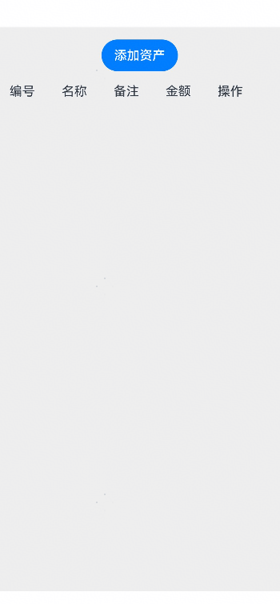

# 资产管理组件快速入门

## AssetCreateSheet

### 简介

AssetCreateSheet 组件支持选择资产类型或新增自定义类型以创建资产数据。开发者可以选择使用组件AssetCreateSheet直接嵌入页面，或使用Builder方法assetCreateSheetBuilder拉起半模态框使用。


### 使用

1. 组件依赖

   由于AssetCreateSheet 组件依赖**asset_base har**包，所以需要将模板根目录的components下**asset_base**目录拷贝至您的工程相应目录，拷贝完成后，在工程目录的`oh-package.json5`文件添加依赖。点击`file->Sync and Refresh Project`进行依赖安装。

   ```typescript
   // asset_manage/oh-package.json5 
   // AssetCreateSheet组件内部依赖情况，注意依赖路径为实际工程的相对路径
   "dependencies": {
     "asset_base": "file:../asset_base"
   }
   ```

2. 安装组件。

   ```ts
   // 在项目根目录build-profile.json5填写asset_base和asset_manage路径，注意路径为实际工程的相对路径
     "modules": [
       {
         "name": "asset_base",
         "srcPath": "./asset_base",
       },
       {
         "name": "asset_manage",
         "srcPath": "./asset_manage",
       }
     ]
   ```

   ```typescript
   // 需要使用组件的模块/oh-package.json5 例如entry/oh-package.json5
   "dependencies": {
     "asset_manage": "file:../asset_manage",
     "asset_base": "file:../asset_base"
   }
   ```

3. 引入组件与相关数据结构定义

   ```ts
   import { AssetCreateSheet, assetCreateSheetBuilder } from 'asset_manage';
   ```


4. 调用组件。

   ```ts
   import { AssetDisplayTypeItem, AssetType } from 'asset_base';
   import { AssetCreateSheet, assetCreateSheetBuilder } from 'asset_manage';
   import { promptAction } from '@kit.ArkUI';
   
   const MOCK_ASSET_TYPE_LIST: AssetDisplayTypeItem[] = [
     {
       name: '现金',
       type: 1,
       subType: 101,
       category: 1,
       icon: $r('app.media.ic_asset_1'),
     },
     {
       name: '银行卡',
       type: 1,
       subType: 102,
       category: 1,
       icon: $r('app.media.ic_asset_2'),
     },
     {
       name: '信用卡',
       type: 2,
       subType: 201,
       category: 2,
       icon: $r('app.media.ic_liability_1'),
     },
   ];
   
   @Entry
   @ComponentV2
   struct AssetCreateSheetExample1 {
     @Local showCreateSheet: boolean = false;
   
     build() {
       Column({ space: 24 }) {
         Text('使用方式1：直接使用组件嵌入页面');
         AssetCreateSheet({
           assetTypeList: MOCK_ASSET_TYPE_LIST,
           handleClick: (type: AssetType, subType?: number) => {
             promptAction.showToast({
               message: '点击了类型为' + type + '子类型为' + subType + '的资产按钮',
             });
           },
         }).height(300);
         Text('使用方式2：使用bindSheet拉起半模态弹框使用');
         Button('打开')
           .onClick(() => {
             this.showCreateSheet = !this.showCreateSheet;
           })
           .bindSheet($$this.showCreateSheet,
             assetCreateSheetBuilder({
               assetTypeList: MOCK_ASSET_TYPE_LIST,
             }), {
               title: { title: '选择资产类型' },
               detents: [SheetSize.MEDIUM],
             });
       }
       .backgroundColor('#eee')
       .padding(16);
     }
   }
   ```


### API参考

#### 子组件

无

#### 接口

AssetCreateSheet(option?:AssetCreateSheetOptions)

创建资产组件。

assetCreateSheetBuilder(options: AssetCreateSheetOptions)

创建资产组件Builder方法。

**参数：**

| 参数名  | 类型                                                        | 必填 | 说明                     |
| ------- | ----------------------------------------------------------- | ---- | ------------------------ |
| options | [AssetCreateSheetOptions](#AssetCreateSheetOptions对象说明) | 否   | 配置创建资产组件的参数。 |

#### AssetCreateSheetOptions对象说明

| 名称          | 类型                                                              | 必填 | 说明                                                           |
| ------------- | ----------------------------------------------------------------- | ---- | -------------------------------------------------------------- |
| bgColor       | ResourceColor                                                     | 否   |                                                                |
| assetTypeList | [AssetDisplayTypeItem](#AssetDisplayTypeItem接口说明)[]           | 否   | 资产类型显示数据数组，默认值为空数组 `[]`                      |
| handleClick   | (type: [AssetType](#AssetType枚举说明), subType?: number) => void | 否   | 点击事件回调函数，接收资产类型 `type` 和可选的子类型 `subType` |

#### AssetDisplayTypeItem接口说明

用于描述资产类型在界面上的显示信息。

| 字段名   | 类型                                    | 必填 | 说明                                                 |
| -------- | --------------------------------------- | ---- | ---------------------------------------------------- |
| name     | string                                  | 是   | 资产类型的名称，例如 "股票"、"基金" 等。             |
| icon     | ResourceStr                             | 是   | 资产类型的图标资源路径或标识符，用于在界面上显示图标 |
| type     | [AssetType](#AssetType枚举说明)         | 是   | 资产类型枚举值）。                                   |
| subType  | number                                  | 是   | 资产类型的子类型编号，用于进一步细分资产类型。       |
| category | [AssetCategory](#AssetCategory枚举说明) | 是   | 资产所属的类别。                                     |
| isCustom | boolean                                 | 否   | 是否为自定义资产类型，默认值为 `false`。             |

#### AssetType枚举说明

用于表示资产的主类型。

| 枚举值 | 值  | 说明     |
| ------ | --- | -------- |
| FUND   | 1   | 资金账户 |
| CREDIT | 2   | 信用账户 |

#### AssetCategory枚举说明

表示资产的分类，用于区分资产和负债类别。

| 名称      | 值  | 说明                       |
| --------- | --- | -------------------------- |
| ASSET     | 1   | 资产，在净资产计算中为正值 |
| LIABILITY | 2   | 负债，在净资产计算中为负值 |

## AssetInfoManageSheet

### 简介

AssetInfoManageSheet组件提供资产信息展示和编辑的能力，根据是否传入初始资产数据，支持资产的创建、编辑和删除操作。它接收资产类型数据、初始资产数据，并通过表单收集和处理资产信息。


### 使用

1. 组件依赖

   由于AssetInfoManageSheet组件依赖**asset_base har**包，所以需要将模板根目录的components下**asset_base**目录拷贝至您的工程相应目录，拷贝完成后，在工程目录的`oh-package.json5`文件添加依赖。点击`file->Sync and Refresh Project`进行依赖安装。

   ```typescript
   // asset_manage/oh-package.json5
   // AssetInfoManageSheet组件内部依赖情况，注意依赖路径为实际工程的相对路径
   "dependencies": {
     "asset_base": "file:../asset_base"
   }
   ```

2. 安装组件。

   ```ts
   // 在项目根目录build-profile.json5填写asset_base和asset_manage路径，注意路径为实际工程的相对路径
     "modules": [
       {
         "name": "asset_base",
         "srcPath": "./asset_base",
       },
       {
         "name": "asset_manage",
         "srcPath": "./asset_manage",
       }
     ]
   ```

   ```typescript
   // 需要使用组件的模块/oh-package.json5 例如entry/oh-package.json5
   "dependencies": {
     "asset_manage": "file:../asset_manage",
     "asset_base": "file:../asset_base"
   }
   ```

3. 引入组件与相关数据结构定义

   ```ts
   import { AssetCreateSheet, assetCreateSheetBuilder } from 'asset_manage';
   ```

4. 调用组件。

   ```ts
   import { AssetDisplayTypeItem } from 'asset_base';
   import { AssetInfoManageSheet, assetInfoManageSheetBuilder } from 'asset_manage';
   import { promptAction } from '@kit.ArkUI';
   
   const MOCK_ASSET_ITEM: AssetDisplayTypeItem = {
     name: '现金',
     type: 1,
     subType: 101,
     category: 1,
     icon: $r('app.media.ic_asset_1'),
   };
   
   @Entry
   @ComponentV2
   struct AssetInfoManageSheetExample1 {
     @Local showManageSheet: boolean = false;
   
     build() {
       Column({ space: 24 }) {
         Text('使用方式1：直接使用组件嵌入页面');
         AssetInfoManageSheet({
           assetTypeItem: MOCK_ASSET_ITEM,
           handleConfirm: () => {
             promptAction.showToast({ message: '保存成功~' });
           },
         }).height(300);
         Text('使用方式2：使用bindSheet拉起半模态弹框');
         Button('打开')
           .onClick(() => {
             this.showManageSheet = !this.showManageSheet;
           })
           .bindSheet($$this.showManageSheet,
             assetInfoManageSheetBuilder({}), {
               title: { title: '编辑资产' },
               detents: [SheetSize.MEDIUM],
             });
       }
       .backgroundColor('#eee')
       .padding(16);
     }
   }
   ```


### API参考

#### 子组件

无

#### 接口

AssetInfoManageSheet(option?:AssetInfoManageSheetOptions)

资产编辑组件。

assetInfoManageSheetBuilder(options: AssetInfoManageSheetOptions)

资产编辑组件Builder方法。

**参数：**

| 参数名  | 类型                                                                | 必填 | 说明           |
| ------- | ------------------------------------------------------------------- | ---- |--------------|
| options | [AssetInfoManageSheetOptions](#AssetInfoManageSheetOptions对象说明) | 否   | 编辑资产信息组件的参数。 |

#### AssetInfoManageSheetOptions对象说明

| 名称              | 类型                                                               | 必填 | 说明                                                       |
| ----------------- | ------------------------------------------------------------------ | ---- | ---------------------------------------------------------- |
| assetTypeItem     | [AssetDisplayTypeItem](#AssetDisplayTypeItem接口说明) \| undefined | 否   | 资产类型显示数据，用于展示资产类型信息（如图标、名称等）。 |
| type              | [AssetType](#AssetType枚举说明)                                    | 否   | 资产的主类型，默认值为 `AssetType.FUND`（资金账户）。      |
| initAsset         | [AssetRecordItemModel](#AssetRecordItemModel对象说明) \| undefined | 否   | 初始资产数据，用于编辑场景。                               |
| handleConfirm     | [AssetRecordItemModel](#AssetRecordItemModel对象说明) => void      | 否   | 表单提交事件回调函数，接收表单数据 `data`。                |
| handleEditSuccess | () => void                                                         | 否   | 编辑成功事件回调函数。                                     |
| handleDelete      | (id: number) => void                                               | 否   | 删除资产事件回调函数，接收资产的唯一标识 `id`。            |

#### AssetRecordItemModel 对象说明

| 名称     | 类型                                    | 必填 | 说明                                            |
| -------- | --------------------------------------- | ---- | ----------------------------------------------- |
| assetId  | number                                  | 是   | 资产的唯一标识符。                              |
| name     | string                                  | 是   | 资产的名称。                                    |
| icon     | ResourceStr                             | 是   | 资产的图标资源路径或标识符。                    |
| type     | [AssetType](#AssetType枚举说明)         | 是   | 资产的主类型，如 `AssetType.FUND`（资金账户）。 |
| subType  | number                                  | 是   | 资产的子类型，用于进一步细分资产类型。          |
| category | [AssetCategory](#AssetCategory枚举说明) | 是   | 资产的类别，如 `AssetCategory.ASSET`（资产）。  |
| note     | string                                  | 否   | 资产的备注信息，可选。                          |
| amount   | number                                  | 是   | 资产的金额或数量。                              |
| isCustom | boolean                                 | 否   | 表示资产是否为自定义资产，可选。                |

## 示例代码

### 示例1 （新增、编辑、删除资产）

```ts
import { AssetRecordItemModel, AssetDisplayTypeItem, AssetRecordItem, AssetType } from 'asset_base';
import { assetCreateSheetBuilder, assetInfoManageSheetBuilder } from 'asset_manage';
import { promptAction } from '@kit.ArkUI';

const MOCK_ASSET_TYPE_LIST: AssetDisplayTypeItem[] = [
  {
    name: '现金',
    type: 1,
    subType: 101,
    category: 1,
    icon: $r('app.media.ic_asset_1'),
  },
  {
    name: '银行卡',
    type: 1,
    subType: 102,
    category: 1,
    icon: $r('app.media.ic_asset_2'),
  },
  {
    name: '信用卡',
    type: 2,
    subType: 201,
    category: 2,
    icon: $r('app.media.ic_liability_1'),
  },
];


@Entry
@ComponentV2
struct PreviewPage {
  @Local showCreateSheet: boolean = false;
  @Local showManageSheet: boolean = false;
  @Local manageItem: AssetDisplayTypeItem | undefined = undefined;
  @Local assetList: AssetRecordItemModel[] = [];
  @Local initAsset: AssetRecordItem | undefined = undefined;

  build() {
    Column({ space: 16 }) {
      Button('添加资产').onClick(() => {
        this.showCreateSheet = true;
      })
        .bindSheet($$this.showCreateSheet,
          assetCreateSheetBuilder({
            assetTypeList: MOCK_ASSET_TYPE_LIST,
            handleClick: (type: AssetType, subType?: number) => {
              this.openManageSheet(type, subType);
            },
          }), {
            title: { title: '选择资产类型' },
          });

      List({ space: 12 }) {
        ListItem() {
          Row() {
            Text('编号').width('20%');
            Text('名称').width('20%');
            Text('备注').width('20%');
            Text('金额').width('20%');
            Text('操作').width('20%');
          }.width('100%');
        };

        ForEach(this.assetList, (asset: AssetRecordItemModel) => {
          ListItem() {
            Row() {
              Text(asset.assetId!.toString()).width('20%');
              Text(asset.name).width('20%');
              Text(asset.note).width('20%');
              Text(asset.amount.toFixed(2)).width('20%');
              Text('编辑').width('20%').fontColor(Color.Blue).onClick(() => {
                this.editAsset(asset);
              });
            };
          };
        });
      }
      .width('100%')
      .layoutWeight(1);
    }
    .padding(16)
    .backgroundColor('#eee')
    .justifyContent(FlexAlign.Start)
    .bindSheet($$this.showManageSheet,
      assetInfoManageSheetBuilder({
        assetTypeItem: this.manageItem,
        initAsset: this.initAsset,
        type: this.manageItem?.type,
        handleConfirm: (data) => {
          this.confirmManage(data)
        },
        handleDelete: (id) => {
          this.deleteAsset(id);
        },
      }), {
        title: { title: '新增资产' },
        onWillDismiss: (action) => {
          this.initAsset = undefined;
          action.dismiss();
        },
      });
  }

  openManageSheet(type: AssetType, subType?: number) {
    console.log('点击了某一项资产，资产类型为' + subType);
    if (subType) {
      const item = MOCK_ASSET_TYPE_LIST.find((it) => it.subType === subType);
      this.manageItem = item!;
    } else {
      this.manageItem = undefined;
    }

    this.showManageSheet = true;
  }

  confirmManage(data: AssetRecordItemModel) {
    console.log(JSON.stringify(data));
    if (data.assetId) {
      let idx = this.assetList.findIndex((item) => item.assetId === data.assetId);
      this.assetList[idx] = data;
    } else {
      data.assetId = this.assetList.length + 1;
      this.assetList.push(data);
    }

    this.showManageSheet = false;
    this.showCreateSheet = false;
  }

  editAsset(item: AssetRecordItemModel) {
    const displayItem: AssetRecordItem = {
      assetId: item.assetId!,
      name: item.name,
      icon: '',
      type: item.type,
      subType: item.subType,
      category: item.category,
      amount: Number(item.amount),
      note: item.note,
      isCustom: item.isCustom,
    };
    this.initAsset = displayItem;
    this.showManageSheet = true;
  }

  deleteAsset(id: number) {
    const idx = this.assetList.findIndex((item) => item.assetId === id);
    console.log('index' + idx);
    if (typeof idx === 'number') {
      this.assetList.splice(idx, 1);
    }
    promptAction.showToast({ message: '删除成功' });
    this.showManageSheet = false;
  }
}
```


