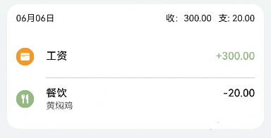
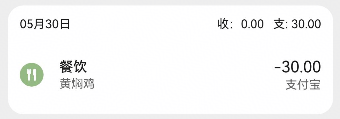
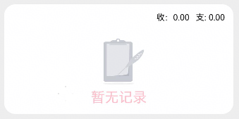
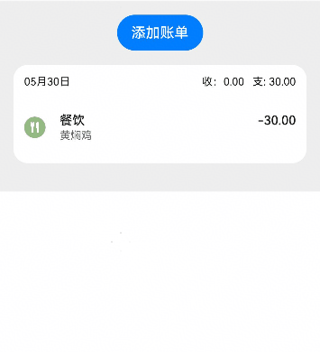
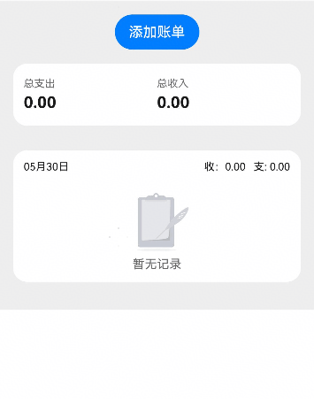
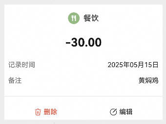
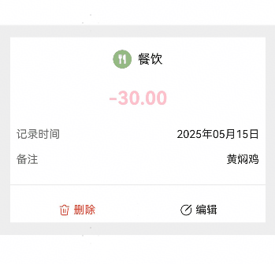

# 账单卡片组件快速入门

[TOC]

## BillCard

### 简介

本组件提供了根据传入数据，展示固定日期账单列表的能力，支持配置卡片各项字号字色等属性，支持配置是否展示当日概况、是否展示侧滑按钮，支持传入回调处理账单条目的点击、删除事件。



### 使用

1. 组件依赖

   由于BillCard组件依赖**bill_base** har包以及**dayjs**三方库，所以需要将模板根目录的components下**bill_base**
   目录拷贝至您的工程相应目录，拷贝完成后，在工程目录的oh-package.json5文件添加依赖。点击file->Sync and Refresh
   Project进行依赖安装

   ```typescript
   // bill_card har包依赖情况
   "dependencies": {
       "dayjs": "^1.11.13",
       "bill_base": "file:../bill_base",
   }
   ```

2. 安装组件。

   ```typescript
   // 需要使用组件的模块/oh-package.json5 例如entry/oh-package.json5
   "dependencies": {
     "bill_card": "file:../bill_card"
   }
   ```

3. 引入组件。

   ```typescript
   import { BillCard } from 'bill_card';
   ```

4. 调用组件。

   ```typescript
   // 引入组件
   import { BalanceChangeType, BillCardItem } from 'bill_base';
   import { BillCard } from 'bill_card';

   const MOCK_BILL_LIST: BillCardItem[] = [
     {
       accountId: 1,
       date: '2025-05-15',
       transactionId: 1,
       resource: 100,
       icon: $r('app.media.ic_expense_0'), // 图片资源需自行替换
       title: '餐饮',
       note: '黄焖鸡',
       amount: 30,
       type: BalanceChangeType.EXPENSE,
       assetName: '支付宝',
     },
   ];

   @Entry
   @ComponentV2
   struct PreviewPage {
     build() {
       Scroll() {
         Column({ space: 16 }) {
           // 账单卡片
           BillCard({
             card: {
               dateStr: '2025-05-30',
               list: MOCK_BILL_LIST,
             },
           });
         }
         .padding(16)
         .backgroundColor('#eee');
       };
     }
   }
   ```

   

### API参考

#### 子组件

无

#### 接口

BillCard(BillCardOption?:BillCardOptions)

账单卡片组件。

**参数：**

#### BillCardOptions对象说明

| 名称                  | 类型                                                | 必填 | 说明                                                 |
| --------------------- | --------------------------------------------------- | ---- | ---------------------------------------------------- |
| card                  | [DailyBillGroupModel](#DailyBillGroupModel对象说明) | 否   | 每日账单分组模型，默认为 `new DailyBillGroupModel()` |
| cardBgColor           | ResourceColor                                       | 否   | 卡片背景颜色，默认值为 `#ffffff`                     |
| showSummary           | boolean                                             | 否   | 是否显示总计，默认值为 `true`                        |
| headerFontSize        | Length                                              | 否   | 标题字体大小，默认值为`12`                           |
| headerFontColor       | ResourceColor                                       | 否   | 标题字体颜色，默认值为 `#E6000000`                   |
| deleteButtonFontSize  | Length                                              | 否   | 删除按钮字体大小，默认值为 `14`                      |
| deleteButtonFontColor | ResourceColor                                       | 否   | 删除按钮字体颜色，默认值为 `#ffffff`                 |
| deleteButtonBgColor   | ResourceColor                                       | 否   | 删除按钮背景颜色，默认值为 `#E84026`                 |
| emptyNoteSize         | Length                                              | 否   | 空提示字体大小，默认值为 `14`                        |
| emptyNoteColor        | ResourceColor                                       | 否   | 空提示字体颜色，默认值为 `#99000000`                 |
| dividerColor          | ResourceColor                                       | 否   | 分割线颜色，默认值为 `##C4C4C4`                      |
| showOperation         | boolean                                             | 否   | 是否显示操作按钮，默认值为 `true`                    |
| handleDelete          | (id: number) => void                                | 否   | 删除按钮点击事件，触发时会传入资产 ID                |
| handleClickItem       | (id: BillCardItem) => void                          | 否   | 点击卡片项事件，触发时会传入卡片项数                 |

#### DailyBillGroupModel对象说明

`DailyBillGroupModel` 是一个实现 `DailyBillGroup` 接口的类，表示每日账单分组模型。

| 名称    | 类型                                    | 必填 | 说明                              |
| ------- | --------------------------------------- | ---- | --------------------------------- |
| dateStr | string                                  | 否   | 日期字符串，默认值为空字符串 `""` |
| list    | [BillCardItem](#BillCardItem对象说明)[] | 否   | 账单项列表，默认值为空数组 `[]`   |

#### BillCardItem对象说明

`BillCardItem` 是一个接口，表示账单项的详细信息。

| 名称          | 类型                                            | 必填 | 说明                      |
| ------------- | ----------------------------------------------- | ---- | ------------------------- |
| accountId     | number                                          | 是   | 账户 ID                   |
| date          | string                                          | 是   | 交易日期                  |
| transactionId | number                                          | 是   | 交易 ID                   |
| resource      | number                                          | 是   | 资源 ID                   |
| icon          | ResourceStr                                     | 是   | 图标资源字符串            |
| title         | string                                          | 是   | 交易标题                  |
| note          | string                                          | 否   | 交易备注（可选）          |
| amount        | number                                          | 是   | 交易金额                  |
| type          | [BalanceChangeType](#BalanceChangeType枚举说明) | 是   | 余额变化类型（收入/支出） |
| assetId       | number                                          | 否   | 资产 ID（可选）           |
| assetName     | string                                          | 否   | 资产名称（可选）          |

#### BalanceChangeType枚举说明

`BalanceChangeType` 是一个枚举类型，表示余额变化的类型，用于区分收入和支出。

| 名称    | 值        | 说明 |
| ------- | --------- | ---- |
| EXPENSE | 'expense' | 支出 |
| INCOME  | 'income'  | 收入 |

## 示例代码

### 示例1 （不传入资产数据时展示空卡片占位图）

```ts
import { BillCard } from 'bill_card';

@Entry
@ComponentV2
struct BillCardExample1 {
  build() {
    Column() {
      BillCard({
        emptyNoteSize: 20,
        emptyNoteColor: Color.Pink,
      });
    }
    .padding(16)
    .backgroundColor('#eee');
  };
}
```



### 示例2 （卡片数据刷新，点击、删除事件的使用）

```ts
import { BalanceChangeType, BillCardItem, DailyBillGroupModel } from 'bill_base';
import { BillCard } from 'bill_card';

@Entry
@ComponentV2
struct BillCardExample2 {
  @Local model: DailyBillGroupModel = new DailyBillGroupModel();

  aboutToAppear(): void {
    this.model.dateStr = '2025-05-30';
  }

  build() {
    Column({ space: 16 }) {
      Button('添加账单')
        .onClick(() => {
          const newItem: BillCardItem = {
            accountId: 1,
            date: '2025-05-30',
            transactionId: new Date().getTime(),
            resource: 100,
            icon: $r('app.media.ic_expense_0'), // 图片需自行替换
            title: '餐饮',
            note: '黄焖鸡',
            amount: 30,
            type: BalanceChangeType.EXPENSE,
          };
          this.model.list.push(newItem);
        });

      BillCard({
        card: this.model,
        handleDelete: (id) => {
          const idx = this.model.list.findIndex((item) => item.transactionId === id);
          if (idx) {
            this.model.list.splice(idx, 1);
          }
        },
      });
    }
    .padding(16)
    .backgroundColor('#eee');
  };
}
```



## BillSummaryCard

### 简介

本组件提供了根据传入数据，展示总支出和总收入的能力，支持自定义标题和内容的字号字色。

### 使用

1. 组件依赖

   由于BillSummaryCard组件依赖**bill_base** har包以及**dayjs**三方库，所以需要将模板根目录的components下**bill_base**
   目录拷贝至您的工程相应目录，拷贝完成后，在工程目录的oh-package.json5文件添加依赖。点击file->Sync and Refresh
   Project进行依赖安装

   ```typescript
   // bill_card har包依赖情况
   "dependencies": {
       "dayjs": "^1.11.13",
       "bill_base": "file:../bill_base",
   }
   ```

2. 安装组件。

   ```typescript
   // 需要使用组件的模块/oh-package.json5 例如entry/oh-package.json5
   "dependencies": {
     "bill_card": "file:../bill_card"
   }
   ```

3. 引入组件。

   ```typescript
   import { BillSummaryCard } from 'bill_card';
   ```

4. 调用组件。

   ```typescript
   import { BillSummaryCard } from 'bill_card';

   @Entry
   @ComponentV2
   struct PreviewPage {
     build() {
       Column() {
         BillSummaryCard({
           totalExpense: '50.00',
           totalIncome: '3000.00',
         });
       }
       .padding(16)
       .backgroundColor('#eee');
     };
   }
   ```

### API参考

#### 子组件

无

#### 接口

BillSummaryCard(BillSummaryCardOptions?:BillSummaryCardOptions)

账单概况组件。

#### BillSummaryCardOptions对象说明

| 名称             | 类型          | 必填 | 说明                               |
| ---------------- | ------------- | ---- | ---------------------------------- |
| totalExpense     | string        | 否   | 总支出，默认值为 `'0.00'`          |
| totalIncome      | string        | 否   | 总收入，默认值为 `'0.00'`          |
| titleFontSize    | Length        | 否   | 标题字体大小，默认值为 `12`        |
| titleFontColor   | ResourceColor | 否   | 标题字体颜色，默认值为 `#99000000` |
| contentFontSize  | Length        | 否   | 内容字体大小，默认值为 `18`        |
| contentFontColor | ResourceColor | 否   | 内容字体颜色，默认值为 `#E6000000` |

### 示例代码

#### 示例1 （账单概况和账单详情卡片联合使用）

```ts
import { BalanceChangeType, BillCardItem, DailyBillGroupModel } from 'bill_base';
import { BillCard, BillSummaryCard } from 'bill_card';

@Entry
@ComponentV2
struct BillSummaryCardExample1 {
  @Local model: DailyBillGroupModel = new DailyBillGroupModel();

  @Computed
  get totalExpense() {
    return this.model.list.reduce((pre, cur) => pre + cur.amount, 0).toFixed(2);
  }

  aboutToAppear(): void {
    this.model.dateStr = '2025-05-30';
  }

  build() {
    Column({ space: 16 }) {
      Button('添加账单')
        .onClick(() => {
          const newItem: BillCardItem = {
            accountId: 1,
            date: '2025-05-30',
            transactionId: new Date().getTime(),
            resource: 100,
            icon: $r('app.media.ic_expense_0'),
            title: '餐饮',
            note: '黄焖鸡',
            amount: 30,
            type: BalanceChangeType.EXPENSE,
          };
          this.model.list.push(newItem);
        });

      BillSummaryCard({
        totalExpense: this.totalExpense,
      });

      BillCard({
        card: this.model,
        handleDelete: (id) => {
          const idx = this.model.list.findIndex((item) => item.transactionId === id);
          if (idx) {
            this.model.list.splice(idx, 1);
          }
        },
      });
    }
    .padding(16)
    .backgroundColor('#eee');
  };
}
```



## BillDetail

### 简介

本组件提供了根据传入数据，展示账单详情卡片的能力。支持设置金额、内容的字号字色，支持设置卡片的背景颜色，支持传入回调处理账单的编辑、删除事件。

### 使用

1. 组件依赖

   由于BillDetail组件依赖**bill_base** har包以及**dayjs**三方库，所以需要将模板根目录的components下**bill_base**
   目录拷贝至您的工程相应目录，拷贝完成后，在工程目录的oh-package.json5文件添加依赖。点击file->Sync and Refresh
   Project进行依赖安装

   ```typescript
   // bill_card har包依赖情况
   "dependencies": {
       "dayjs": "^1.11.13",
       "bill_base": "file:../bill_base",
   }
   ```

2. 安装组件。

   ```typescript
   // 需要使用组件的模块/oh-package.json5 例如entry/oh-package.json5
   "dependencies": {
     "bill_card": "file:../bill_card"
   }
   ```

3. 引入组件。

   ```typescript
   import { BillDetail } from 'bill_card';
   ```

4. 调用组件。

   ```ts
   import { BalanceChangeType, BillCardItem } from 'bill_base';
   import { BillDetail } from 'bill_card';

   const MOCK_BILL_ITEM: BillCardItem = {
       accountId: 1,
       date: '2025-05-15',
       transactionId: 1,
       resource: 100,
       icon: $r('app.media.ic_expense_0'),
       title: '餐饮',
       note: '黄焖鸡',
       amount: 30,
       type: BalanceChangeType.EXPENSE,
       assetName: '支付宝',
     };

   @Entry
   @ComponentV2
   struct BillDetailExample1 {
     build() {
       Column() {
         // 账单卡片
         BillDetail({
           bill: MOCK_BILL_ITEM,
         });
       }
       .padding(16)
       .backgroundColor('#eee');
     };
   }
   ```

   

### API参考

#### 子组件

无

#### 接口

BillDetail(BillDetailOption?:BillDetailOptions)

账单概况组件。

#### BillDetail 对象说明

| 名称             | 类型                                  | 必填 | 说明                               |
| ---------------- | ------------------------------------- | ---- | ---------------------------------- |
| bill             | [BillCardItem](#BillCardItem对象说明) | 是   | 账单详情数据，必填字段             |
| amountFontColor  | ResourceColor                         | 否   | 标题字体颜色，默认值为 `#E6000000` |
| amountFontSize   | Length                                | 否   | 金额字体大小，默认值为 `24`        |
| contentFontSize  | Length                                | 否   | 内容字体大小，默认值为 `14`        |
| contentFontColor | ResourceColor                         | 否   | 内容字体颜色，默认值为 `#E6000000` |
| bgColor          | ResourceColor                         | 否   | 背景颜色，默认值为 `#ffffff`       |
| handleDelete     | () => void                            | 否   | 删除按钮点击事件处理函数           |
| handleEdit       | () => void                            | 否   | 编辑按钮点击事件处理函数           |

### 示例代码

#### 示例1 （卡片展示与编辑、删除事件使用）

```ts
import { BalanceChangeType, BillCardItem } from 'bill_base';
import { BillDetail } from 'bill_card';
import { promptAction } from '@kit.ArkUI';

const MOCK_BILL_ITEM: BillCardItem =
  {
    accountId: 1,
    date: '2025-05-15',
    transactionId: 1,
    resource: 100,
    icon: $r('app.media.ic_expense_0'),
    title: '餐饮',
    note: '黄焖鸡',
    amount: 30,
    type: BalanceChangeType.EXPENSE,
    assetName: '支付宝',
  };

@Entry
@ComponentV2
struct BillDetailExample1 {
  @Local bill: BillCardItem = MOCK_BILL_ITEM;

  build() {
    Column() {
      // 账单卡片
      BillDetail({
        bill: this.bill,
        amountFontColor: Color.Pink,
        handleEdit: () => {
          promptAction.showToast({
            message: '触发了账单的编辑事件，随机生成一个金额',
            alignment: Alignment.Top,
          });
          const newBill = JSON.parse(JSON.stringify(MOCK_BILL_ITEM)) as BillCardItem;
          newBill.amount = (Math.random() * 100);
          this.bill = newBill;
        },
        handleDelete: () => {
          promptAction.showToast({ message: '触发了账单的删除事件', alignment: Alignment.Top });
        },
      });
    }
    .padding(16)
    .backgroundColor('#eee');
  };
}
```


