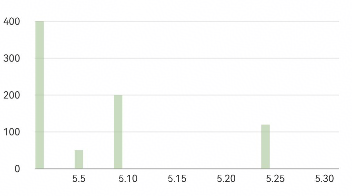
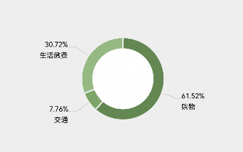
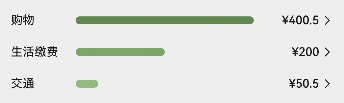
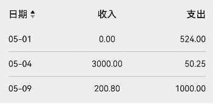
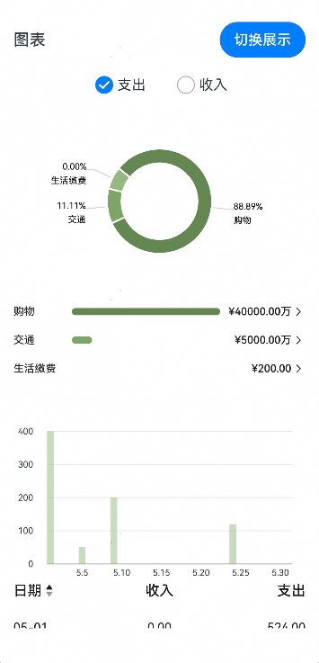

# 账单图表组件包快速入门

## BillBarChart

### 简介

BillBarChart 组件提供了根据传入数据，展示账单柱状图的能力。支持设置图表高度、颜色、标记样式等参数，支持自定义 UI 信息和交互逻辑。



### 使用

1. 组件依赖

   由于BillBarChart组件依赖**@ohos/mpchart, dayjs, lunar**三方库，所以需要在工程目录的oh-package.json5文件添加依赖。点击file->Sync and Refresh Project进行依赖安装

   ```typescript
   // bill_card har包依赖情况
   "dependencies": {
       "@ohos/mpchart": "3.0.22",
       "dayjs": "1.11.13",
       "lunar": "^1.0.0"
   }
   ```

2. 安装组件包。

   ```typescript
   // 需要使用组件的模块/oh-package.json5 例如entry/oh-package.json5
   "dependencies": {
     "bill_chart": "file:../bill_chart"
   }
   ```

3. 引入组件。

   ```typescript
   import { BillBarChart } from 'bill_chart';
   ```

4. 调用组件。

   ```typescript
   import { BillBarChart, BillBarChartData, BillBarItem } from 'bill_chart';

   const MOCK_CHART_LIST: BillBarItem[] = [
     {
       date: "05-01",
       value: 400.5,
     },
     {
       date: "05-05",
       value: 50.5,
     },
     {
       date: "05-09",
       value: 200,
     },
     {
       date: "05-24",
       value: 120,
     },
   ];

   const MOCK_BAR_CHART_DATA: BillBarChartData = {
     month: "2025-05",
     data: MOCK_CHART_LIST,
   };

   @Entry
   @ComponentV2
   struct BillBarChartExample {
     build() {
       Column() {
         BillBarChart({
           chartData: MOCK_BAR_CHART_DATA,
         });
       };
     }
   }

   ```

### API参考

#### 子组件

无

#### 接口

BillBarChart(options:BillBarChartOptions)

#### BillBarChartOptions 对象说明

| 名称           | 类型                                          | 必填 | 说明                                  |
| -------------- | --------------------------------------------- | ---- | ------------------------------------- |
| chartData      | [BillBarChartData](#BillBarChartData接口说明) | 是   | 柱状图数据，必填字段                  |
| chartHeight    | Length                                        | 否   | 柱状图高度，默认值为 `200`            |
| initColor      | number                                        | 否   | 柱状图初始颜色，默认值为 `0x8094B982` |
| highlightColor | number                                        | 否   | 柱状图高亮颜色，默认值为 `0x94B982`   |
| markerColor    | ResourceColor                                 | 否   | 标记颜色，默认值为 `#e6000000`        |
| markerFontSize | Length                                        | 否   | 标记字体大小，默认值为 `12`           |

#### BillBarChartData接口说明

| 名称  | 类型                                  | 必填 | 说明           |
| ----- | ------------------------------------- | ---- | -------------- |
| data  | [BillBarItem](#BillBarItem接口说明)[] | 是   | 账单数据数组   |
| month | string                                | 是   | 当前月份字符串 |

#### BillBarItem接口说明

| 名称  | 类型   | 必填 | 说明                       |
| ----- | ------ | ---- | -------------------------- |
| date  | string | 是   | 日期字符串，格式YYYY-MM-DD |
| value | number | 是   | 对应的金额                 |

## BillCalendar

### 简介

BillCalendar 组件提供了根据传入数据，展示日历视图的能力。支持设置月份、卡片高度、背景颜色等参数，支持处理日期点击事件。


### 使用

1. 组件依赖

   由于BillBarChart组件依赖**@ohos/mpchart, dayjs, lunar**三方库，所以需要在工程目录的oh-package.json5文件添加依赖。点击file->Sync and Refresh Project进行依赖安装

   ```typescript
   // bill_card har包依赖情况
   "dependencies": {
       "@ohos/mpchart": "3.0.22",
       "dayjs": "1.11.13",
       "lunar": "^1.0.0"
   }
   ```

2. 安装组件包。

   ```typescript
   // 需要使用组件的模块/oh-package.json5 例如entry/oh-package.json5
   "dependencies": {
     "bill_chart": "file:../bill_chart"
   }
   ```

3. 引入组件。

   ```typescript
   import { BillCalendar } from 'bill_chart';
   ```

4. 调用组件。

   ```typescript
   import { BillCalendar, CalendarBillSummaryModel } from 'bill_chart';

   @Entry
   @ComponentV2
   struct BillCalenderExample {
     @Local summary: CalendarBillSummaryModel = new CalendarBillSummaryModel();

     aboutToAppear(): void {
       this.summary.date = '2025-05-15';
       this.summary.totalExpense = 200;
       this.summary.totalIncome = 100;
     }

     build() {
       Column({ space: 16 }) {
         Text('日历视图');
         BillCalendar({
           selectedDateSummary: this.summary,
         });
       }
       .padding(16)
       .backgroundColor('#eee');
     }
   }

   ```

### API参考

#### 子组件

无

#### 接口

BillCalendar(options: BillCalendarOptions)

#### BillCalendarOptions 对象说明

| 名称                | 类型                                                          | 必填 | 说明                                                             |
| ------------------- | ------------------------------------------------------------- | ---- | ---------------------------------------------------------------- |
| month               | string                                                        | 否   | 月份字符串，格式YYYY-MM，默认值为 当前月份                       |
| selectedDateSummary | [CalendarBillSummaryModel](#CalendarBillSummaryModel对象说明) | 否   | 选中日期的账单摘要，默认值为 `new CalendarBillSummaryModel()`    |
| calendarHeight      | Length                                                        | 否   | 日历视图的高度，默认值为 `360`                                   |
| bgColor             | ResourceColor                                                 | 否   | 日历视图的背景颜色，默认值为 `#ffffff`                           |
| handleDateClick     | (dateStr: string) => void                                     | 否   | 日期点击事件回调函数，接收点击的日期字符串参数，格式为YYYY-MM-DD |

#### CalendarBillSummaryModel对象说明

| 名称         | 类型   | 必填 | 说明                      |
| ------------ | ------ | ---- | ------------------------- |
| date         | string | 否   | 日期字符串，默认值为''    |
| totalExpense | number | 否   | 当日总支出金额, 默认值为0 |
| totalIncome  | number | 否   | 当日总收入金额, 默认值为0 |

## BillPieChart

### 简介

BillPieChart 组件提供了根据传入数据，展示饼图的能力。支持设置图表数据、颜色、字体样式、高度等参数，便于展示分类数据的占比关系。



### 使用

1. 组件依赖

   由于BillBarChart组件依赖**@ohos/mpchart, dayjs, lunar**三方库，所以需要在工程目录的oh-package.json5文件添加依赖。点击file->Sync and Refresh Project进行依赖安装

   ```typescript
   // bill_card har包依赖情况
   "dependencies": {
       "@ohos/mpchart": "3.0.22",
       "dayjs": "1.11.13",
       "lunar": "^1.0.0"
   }
   ```

2. 安装组件包。

   ```typescript
   // 需要使用组件的模块/oh-package.json5 例如entry/oh-package.json5
   "dependencies": {
     "bill_chart": "file:../bill_chart"
   }
   ```

3. 引入组件。

   ```typescript
   import { BillPieChart } from 'bill_chart';
   ```

4. 调用组件。

   ```typescript

   import { BillPieChart, BillPieChartItem } from 'bill_chart';

   const MOCK_COLOR_LIST: number[] = [
     0x638750, 0x7ea568, 0x94b982, 0xabd39c, 0xc6e5b9, 0xdff3d7, 0xf2fdee,
   ];

   const MOCK_CHART_DATA: BillPieChartItem[] = [
     {
       label: "购物",
       value: 400.5,
       resource: 204,
     },
     {
       label: "交通",
       value: 50.5,
       resource: 202,
     },
     {
       label: "生活缴费",
       value: 200,
       resource: 209,
     },
   ];

   @Entry
   @ComponentV2
   struct BillPieChartExample {
     build() {
       Column({ space: 16 }) {
         BillPieChart({
           chartData: MOCK_CHART_DATA,
           colorList: MOCK_COLOR_LIST,
         });
       }
       .padding(16)
       .backgroundColor('#eee');
     }
   }
   ```

### API参考

#### 子组件

无

#### 接口

BillPieChart(options?:BillPieChartOptions)

#### BillPieChartOptions 对象说明

| 名称           | 类型                                            | 必填 | 说明                                    |
| -------------- | ----------------------------------------------- | ---- | --------------------------------------- |
| chartData      | [BillPieChartItem](#BillPieChartItem接口说明)[] | 否   | 饼图数据数组，默认值为空数组 `[]`       |
| colorList      | number[]                                        | 否   | 饼图颜色列表，默认值为空数组 `[]`       |
| valueColor     | number                                          | 否   | 数据值的颜色，默认值为 `0x000000`       |
| valueSize      | number                                          | 否   | 数据值的字体大小，默认值为 `10`         |
| labelColor     | number                                          | 否   | 数据标签的颜色，默认值为`0x000000`      |
| labelSize      | number                                          | 否   | 数据标签的字体大小，默认值为 `10`       |
| valueLineColor | number                                          | 否   | 数据值的连接线颜色，默认值为 `0xd0d0d0` |
| chartHeight    | Length                                          | 否   | 饼图的高度，默认值为 `200`              |

#### BillPieChartItem接口说明

| 名称     | 类型   | 必填 | 说明             |
| -------- | ------ | ---- | ---------------- |
| label    | string | 是   | 数据项的标签     |
| value    | number | 是   | 数据项的值       |
| resource | number | 是   | 数据项的资源标识 |

## BillRanking

### 简介

BillRanking 组件提供了根据传入数据，展示账单项金额排行榜的能力。支持设置颜色、数据、最大条目长度、标签样式等参数，支持处理条目点击事件。



### 使用

1. 组件依赖

   由于BillBarChart组件依赖**@ohos/mpchart, dayjs, lunar**三方库，所以需要在工程目录的oh-package.json5文件添加依赖。点击file->Sync and Refresh Project进行依赖安装

   ```typescript
   // bill_card har包依赖情况
   "dependencies": {
       "@ohos/mpchart": "3.0.22",
       "dayjs": "1.11.13",
       "lunar": "^1.0.0"
   }
   ```

2. 安装组件包。

   ```typescript
   // 需要使用组件的模块/oh-package.json5 例如entry/oh-package.json5
   "dependencies": {
     "bill_chart": "file:../bill_chart"
   }
   ```

3. 引入组件。

   ```typescript
   import { BillRanking } from 'bill_chart';
   ```

4. 调用组件。

   ```typescript
   import { BillRanking, BillPieChartItem } from 'bill_chart';

   const MOCK_COLOR_LIST: number[] = [
     0x638750, 0x7ea568, 0x94b982, 0xabd39c, 0xc6e5b9, 0xdff3d7, 0xf2fdee,
   ];

   const MOCK_CHART_DATA: BillPieChartItem[] = [
     {
       label: "购物",
       value: 400.5,
       resource: 204,
     },
     {
       label: "交通",
       value: 50.5,
       resource: 202,
     },
     {
       label: "生活缴费",
       value: 200,
       resource: 209,
     },
   ];

   @Entry
   @ComponentV2
   struct BillRankingExample {
     build() {
       Column({ space: 16 }) {
          BillRanking({
           chartData: MOCK_CHART_DATA,
           colorList: MOCK_COLOR_LIST,
         });
       }
       .padding(16)
       .backgroundColor('#eee');
     }
   }
   ```

### API参考

#### 子组件

无

#### 接口

BillRanking(options?:BillRankingOptions)

#### BillRankingOptions对象说明

| 名称           | 类型                                            | 必填 | 说明                                             |
| -------------- | ----------------------------------------------- | ---- | ------------------------------------------------ |
| colorList      | number[]                                        | 否   | 排行榜条目颜色列表，用于设置每个条目的颜色       |
| chartData      | [BillPieChartItem](#BillPieChartItem接口说明)[] | 否   | 排行榜数据数组，用于展示排行榜的内容             |
| maxBarLength   | number                                          | 否   | 排行榜条目的最大长度，默认值为 `180`             |
| labelColor     | ResourceColor                                   | 否   | 排行榜标签的颜色，默认值为 `#e6000000`           |
| labelSize      | Length                                          | 否   | 排行榜标签的字体大小，默认值为 `12`              |
| handleClickBar | (resource: number) => void                      | 否   | 条目点击事件回调函数，接收点击的条目资源标识参数 |

## BillReportTable

### 简介

BillReportTable 组件提供了根据传入数据，展示报表表格的能力。支持设置表格数据、字体大小、颜色、排序方向等参数，便于展示账单的详细信息。



### 使用

1. 组件依赖

   由于BillBarChart组件依赖**@ohos/mpchart, dayjs, lunar**三方库，所以需要在工程目录的oh-package.json5文件添加依赖。点击file->Sync and Refresh Project进行依赖安装

   ```typescript
   // bill_card har包依赖情况
   "dependencies": {
       "@ohos/mpchart": "3.0.22",
       "dayjs": "1.11.13",
       "lunar": "^1.0.0"
   }
   ```

2. 安装组件包。

   ```typescript
   // 需要使用组件的模块/oh-package.json5 例如entry/oh-package.json5
   "dependencies": {
     "bill_chart": "file:../bill_chart"
   }
   ```

3. 引入组件。

   ```typescript
   import { BillReportTable } from 'bill_chart';
   ```

4. 调用组件。

   ```typescript
   import { BillReportTable, ReportTableItem } from 'bill_chart';

   const MOCK_TABLE_DATA: ReportTableItem[] = [
     {
       date: "05-01",
       totalIncome: 0,
       totalExpense: 524,
     },
     {
       date: "05-04",
       totalIncome: 3000,
       totalExpense: 50.25,
     },
     {
       date: "05-09",
       totalIncome: 200.8,
       totalExpense: 1000,
     },
   ];

   @Entry
   @ComponentV2
   struct BillReportTableExample {
     build() {
       Column({ space: 16 }) {
         BillReportTable({
           tableData: MOCK_TABLE_DATA,
         });
       }
       .padding(16)
       .backgroundColor('#eee');
     }
   }
   ```

### API参考

#### 子组件

无

#### 接口

BillReportTable(options?:BillReportTableOptions)

#### BillReportTableOptions 对象说明

| 名称             | 类型                                          | 必填 | 说明                                   |
| ---------------- | --------------------------------------------- | ---- | -------------------------------------- |
| tableData        | [ReportTableItem](#ReportTableItem接口说明)[] | 否   | 表格数据数组，默认值为空数组 `[]`      |
| headerFontSize   | Length                                        | 否   | 表头字体大小，默认值为 `16`            |
| headerFontColor  | ResourceColor                                 | 否   | 表头字体颜色，默认值为 `#e6000000`     |
| contentFontSize  | Length                                        | 否   | 表格内容字体大小，默认值为 `14`        |
| contentFontColor | ResourceColor                                 | 否   | 表格内容字体颜色，默认值为 `#e6000000` |
| ascend           | boolean                                       | 否   | 是否按升序排序，默认值为 `true`        |

#### ReportTableItem接口说明

**字段说明**

| 名称         | 类型   | 必填 | 说明           |
| ------------ | ------ | ---- | -------------- |
| date         | string | 是   | 日期字符串     |
| totalIncome  | number | 是   | 当日总收入金额 |
| totalExpense | number | 是   | 当日总支出金额 |

## 示例代码

```TS
// MockData.ets
import { BillBarItem, BillPieChartItem, ReportTableItem } from 'bill_chart';

export const MOCK_BAR_CHART_LIST: BillBarItem[] = [
  {
    date: '05-01',
    value: 400.5,
  },
  {
    date: '05-05',
    value: 50.5,
  },
  {
    date: '05-09',
    value: 200,
  },
  {
    date: '05-24',
    value: 120,
  },
];

export const MOCK_BAR_CHART_LIST2: BillBarItem[] = [
  {
    date: '05-06',
    value: 100,
  },
  {
    date: '05-14',
    value: 198.9,
  },
  {
    date: '05-30',
    value: 3000,
  },
];

export const MOCK_COLOR_LIST: number[] = [
  0x638750, 0x7ea568, 0x94b982, 0xabd39c, 0xc6e5b9, 0xdff3d7, 0xf2fdee,
];

export const MOCK_COLOR_LIST2: number[] = [
  0xd77525, 0xf2992c, 0xfbb935, 0xffce52, 0xffe38e, 0xfff1ca, 0xfffbef,
];

export const MOCK_PIE_CHART_LIST: BillPieChartItem[] = [
  {
    label: '购物',
    value: 400.5,
    resource: 104,
  },
  {
    label: '交通',
    value: 50.5,
    resource: 102,
  },
  {
    label: '生活缴费',
    value: 200,
    resource: 109,
  },
];

export const MOCK_PIE_CHART_LIST2: BillPieChartItem[] = [
  {
    label: '工资',
    value: 3000,
    resource: 201,
  },
  {
    label: '理财',
    value: 200,
    resource: 202,
  },
];

export const MOCK_TABLE_DATA: ReportTableItem[] = [
  {
    date: '05-01',
    totalIncome: 0,
    totalExpense: 524,
  },
  {
    date: '05-04',
    totalIncome: 3000,
    totalExpense: 50.25,
  },
  {
    date: '05-09',
    totalIncome: 200.8,
    totalExpense: 1000,
  },
];

```

```ts
import {
  MOCK_PIE_CHART_LIST,
  MOCK_PIE_CHART_LIST2,
  MOCK_BAR_CHART_LIST,
  MOCK_BAR_CHART_LIST2,
  MOCK_COLOR_LIST,
  MOCK_COLOR_LIST2,
  MOCK_TABLE_DATA,
} from './Mockdata';
import {
    BillPieChart,
    BillRanking,
    BillBarChart,
    BillReportTable,
    BillCalendar,
    BillBarChartData,
    CalendarBillSummaryModel
} from 'bill_chart';


@Entry
@ComponentV2
struct PreviewPage {
  @Local showChart: boolean = true;
  @Local isExpense: boolean = true;
  @Local summary: CalendarBillSummaryModel = new CalendarBillSummaryModel();

  @Computed
  get barData(): BillBarChartData {
    const list = this.isExpense ? MOCK_BAR_CHART_LIST : MOCK_BAR_CHART_LIST2;
    return {
      month: '2025-05',
      data: list,
    };
  }

  @Computed
  get barColor() {
    return this.isExpense ? 0x8094b982 : 0x80f2992c;
  }

  @Computed
  get colorList() {
    return this.isExpense ? MOCK_COLOR_LIST : MOCK_COLOR_LIST2;
  }

  @Computed
  get pieData() {
    return this.isExpense ? MOCK_PIE_CHART_LIST : MOCK_PIE_CHART_LIST2;
  }

  build() {
    Column({ space: 16 }) {
      Row() {
        Text(this.showChart ? '图表' : '日历').fontSize(18).fontWeight(FontWeight.Medium);
        Button('切换展示')
          .onClick(() => {
            this.showChart = !this.showChart;
          });
      }.width('100%').justifyContent(FlexAlign.SpaceBetween);

      if (this.showChart) {
        Row() {
          Radio({ value: 'Radio1', group: 'radioGroup' }).checked(true)
            .onChange((isChecked: boolean) => {
              this.isExpense = isChecked;
            });
          Text('支出');
          Blank().width(30);
          Radio({ value: 'Radio2', group: 'radioGroup' }).checked(false)
            .onChange((isChecked: boolean) => {
              this.isExpense = !isChecked;
            });
          Text('收入');
        };

        Scroll() {
          Column({ space: 16 }) {
            // 饼图
            BillPieChart({
              chartData: this.pieData,
              colorList: this.colorList,
            });
            // 账单列表图
            BillRanking({
              chartData: this.pieData,
              colorList: this.colorList,
            });
            //柱状图
            BillBarChart({
              chartData: this.barData,
              initColor: this.barColor,
            });
            // 报表
            BillReportTable({
              tableData: MOCK_TABLE_DATA,
            });
          };
        }
        .layoutWeight(1)
        .scrollBar(BarState.Off)
      } else {
        // 日历视图
        BillCalendar({
          selectedDateSummary: this.summary,
          handleDateClick: (date) => {
            this.summary.date = date;
          },
        });
      }
    }
    .padding(16);
  }
}
```


