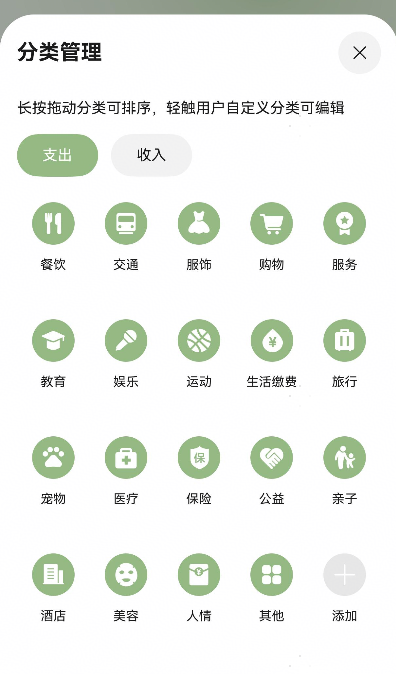

# bill_manage组件包快速入门

## BillManageSheet

### 简介

`BillManageSheet` 组件用于管理账单信息，支持初始化账单数据、处理确认操作和资源管理操作。


### 使用

1. 组件依赖

   由于BillManageSheet组件依赖**bill_base har**包，所以需要将模板根目录的components下**bill_base **
   目录拷贝至您的工程相应目录，拷贝完成后，在工程目录的`oh-package.json5`文件添加依赖。点击`file->Sync and Refresh Project`
   进行依赖安装。

   ```typescript
   // bill_manage/oh-package.json5
   // BillManageSheet，注意依赖路径为实际工程的相对路径
   "dependencies": {
     "bill_base ": "file:../bill_base "
   }
   ```

2. 安装组件。

   ```ts
   // 在项目根目录build-profile.json5填写bill_base和bill_manage路径，注意路径为实际工程的相对路径
     "modules": [
       {
         "name": "bill_base",
         "srcPath": "./bill_base",
       },
       {
         "name": "bill_manage",
         "srcPath": "./bill_manage",
       }
     ]
   ```

   ```typescript
   // 需要使用组件的模块/oh-package.json5 例如entry/oh-package.json5
   "dependencies": {
     "bill_manage": "file:../bill_manage"
   }
   ```

3. 引入组件与相关数据结构定义

   ```ts
   import { BillManageSheet, billManageSheetBuilder } from 'bill_manage';
   ```

4. 调用组件。

   ```ts
   import { BillManageSheet, billManageSheetBuilder } from 'bill_manage';

   @Entry
   @ComponentV2
   struct BillManageSheetExample1 {
     @Local showCreateSheet: boolean = false;
     @Local stack: NavPathStack = new NavPathStack();

     @Builder
     pageMap(url: string) {
       if (url === 'useComponent') {
         UseComponent();
       }
     }

     build() {
       Navigation(this.stack) {
         Column({ space: 24 }) {
           Text('使用方式1：直接使用组件嵌入页面');
           Button('打开')
             .onClick(() => {
               this.stack.pushPath({ name: 'useComponent' });
             });
           Text('使用方式2：使用bindSheet拉起半模态弹框使用');
           Button('打开')
             .onClick(() => {
               this.showCreateSheet = !this.showCreateSheet;
             })
             .bindSheet($$this.showCreateSheet,
               billManageSheetBuilder({}), {
                 title: { title: '选择资产类型' },
                 detents: [SheetSize.FIT_CONTENT],
               });
         };

       }
       .navDestination(this.pageMap);
     }
   }

   @ComponentV2
   struct UseComponent {
     build() {
       NavDestination() {
         BillManageSheet();
       }
       .title('创建账单');
     }
   }
   ```


### API参考

#### 子组件

无

#### 接口

BillManageSheet(option?:BillManageSheetOptions)

创建账单组件。

billManageSheetBuilder(options: BillManageSheetOptions)

创建账单组件Builder方法。

**参数：**

| 参数名     | 类型                                                    | 必填 | 说明           |
|---------|-------------------------------------------------------|----|--------------|
| options | [BillManageSheetOptions](#BillManageSheetOptions对象说明) | 否  | 配置创建账单组件的参数。 |

#### BillManageSheetOptions对象说明

| 名称                   | 类型                                                      | 是否必填 | 说明                          |
|----------------------|---------------------------------------------------------|------|-----------------------------|
| initBill             | [BillManageModel](#BillManageModel对象说明) \| undefined    | 否    | 初始化账单数据，用于展示或编辑现有账单。        |
| handleConfirm        | (data: [BillManageModel](#BillManageModel对象说明)) => void | 否    | 确认操作事件回调函数，接收用户交易数据 `data`。 |
| handleResourceManage | () => void                                              | 否    | 资源管理操作事件回调函数，用于处理资源管理逻辑。    |

#### BillManageModel对象说明

| 名称            | 类型                                          | 是否必填 | 说明                     |
|---------------|---------------------------------------------|------|------------------------|
| accountId     | number                                      | 是    | 账户 ID，标识当前账单所属的账户。     |
| type          | [BalanceChangeType](#BalanceChangeType枚举说明) | 是    | 交易类型，表示账单的类型（如收入或支出）   |
| transactionId | number \| undefined                         | 否    | 交易 ID，用于标识具体的交易记录，可选   |
| resource      | number                                      | 是    | 资源 ID，表示账单相关的资源信息。     |
| amount        | number                                      | 是    | 交易金额，表示账单的金额。          |
| date          | string                                      | 是    | 交易日期，格式为 `yyyy-mm-dd`。 |
| note          | string \| undefined                         | 否    | 备注信息，用于记录账单的额外说明，可选。   |
| assetId       | number \| undefined                         | 否    | 资产 ID，表示账单相关的资产信息，可选。  |

#### BalanceChangeType枚举说明

`BalanceChangeType` 是一个枚举类型，表示余额变化的类型，用于区分收入和支出。

| 名称      | 值         | 说明 |
|---------|-----------|----|
| EXPENSE | 'expense' | 支出 |
| INCOME  | 'income'  | 收入 |

### 示例代码

#### 示例1 （新增、编辑账单）

```ts
import { BillManageModel, billManageSheetBuilder } from 'bill_manage';
import { promptAction } from '@kit.ArkUI';

@Entry
@ComponentV2
struct BillManageSheetExample1 {
  @Local showSheet: boolean = false;
  @Local bill: BillManageModel | undefined = undefined;

  build() {
    Column({ space: 24 }) {
      Row() {
        Button(this.bill ? '编辑账单' : '创建账单')
          .onClick(() => {
            this.showSheet = !this.showSheet;
          });
        if (this.bill) {
          Button('删除账单')
            .onClick(() => {
              this.bill = undefined;
              promptAction.showToast({ message: '删除账单成功！' });
            });
        }
      };

      if (this.bill) {
        Column() {
          Text('账单');
          Text('日期： ' + this.bill.date);
          Text('来源： ' + this.bill.resource);
          Text('金额： ' + this.bill.amount);
        }
        .alignItems(HorizontalAlign.Start);
      }

    }
    .bindSheet($$this.showSheet,
      billManageSheetBuilder({
        initBill: this.bill,
        handleConfirm: (data) => {
          this.bill = data;
          this.showSheet = false;
        },
        handleResourceManage: () => {
          promptAction.showToast({ message: '详见ResourceManageSheet组件' });
        },
      }), {
        title: { title: '选择资产类型' },
        detents: [SheetSize.FIT_CONTENT],
      });
  }
}


```


## ResourceManageSheet

### 简介

`ResourceManageSheet` 是一个用于管理账单来源分类的组件，支持处理弹出操作以及删除操作的成功回调。



### 使用

1. 组件依赖

   由于BillManageSheet组件依赖**bill_base har**包，所以需要将模板根目录的components下**bill_base **
   目录拷贝至您的工程相应目录，拷贝完成后，在工程目录的`oh-package.json5`文件添加依赖。点击`file->Sync and Refresh Project`
   进行依赖安装。

   ```typescript
   // bill_manage/oh-package.json5
   // BillManageSheet，注意依赖路径为实际工程的相对路径
   "dependencies": {
     "bill_base ": "file:../bill_base "
   }
   ```

2. 安装组件。

   ```ts
   // 在项目根目录build-profile.json5填写bill_base和bill_manage路径，注意路径为实际工程的相对路径
     "modules": [
       {
         "name": "bill_base",
         "srcPath": "./bill_base",
       },
       {
         "name": "bill_manage",
         "srcPath": "./bill_manage",
       }
     ]
   ```

   ```typescript
   // 需要使用组件的模块/oh-package.json5 例如entry/oh-package.json5
   "dependencies": {
     "bill_manage": "file:../bill_manage"
   }
   ```

3. 引入组件与相关数据结构定义

   ```ts
   import {
     ResourceManageSheet,
     resourceManageSheetBuilder,
   } from 'asset_manage';
   ```

4. 调用组件.

   ```ts
   import { ResourceManageSheet, resourceManageSheetBuilder } from 'bill_manage';

   @Entry
   @ComponentV2
   struct ResourceManageSheet1Example1 {
     @Local showSheet: boolean = false;
     @Local stack: NavPathStack = new NavPathStack();

     @Builder
     pageMap(url: string) {
       if (url === 'useComponent') {
         UseComponent();
       }
     }

     build() {
       Navigation(this.stack) {
         Column({ space: 24 }) {
           Text('使用方式1：直接使用组件嵌入页面');
           Button('打开')
             .onClick(() => {
               this.stack.pushPath({ name: 'useComponent' });
             });
           Text('使用方式2：使用bindSheet拉起半模态弹框使用');
           Button('打开')
             .onClick(() => {
               this.showSheet = !this.showSheet;
             })
             .bindSheet($$this.showSheet,
               resourceManageSheetBuilder({}), {
                 title: { title: '分类管理' },
                 detents: [SheetSize.FIT_CONTENT],
               });
         };

       }
       .navDestination(this.pageMap);
     }
   }


   @ComponentV2
   struct UseComponent {
     build() {
       NavDestination() {
         ResourceManageSheet();
       }
       .title('创建账单');
     }
   }

   ```


### API参考

#### 子组件

无

#### 接口

ResourceManageSheet(option?:ResourceManageSheetOptions)

创建账单组件。

resourceManageSheetBuilder(options: ResourceManageSheetOptions)

创建账单组件Builder方法。

**参数：**

| 参数名     | 类型                                                            | 必填 | 说明           |
|---------|---------------------------------------------------------------|----|--------------|
| options | [ResourceManageSheetOptions](#ResourceManageSheetOptions对象说明) | 否  | 配置创建资产组件的参数。 |

#### ResourceManageSheetOptions对象说明

| 名称                  | 类型                    | 说明                                  |
|---------------------|-----------------------|-------------------------------------|
| handleAddSuccess    | () => void            | 处理弹出操作的事件回调函数。                      |
| handleDeleteSuccess | (key: number) => void | 处理删除操作成功时的事件回调函数，接收被删除项的唯一标识 `key`。 |

### 示例代码

#### 示例1 （新增账单来源分类，删除分类）

```ts
import { promptAction } from '@kit.ArkUI';
import { BillManageModel, billManageSheetBuilder, resourceManageSheetBuilder } from 'bill_manage';
import { ResourceUtil } from 'bill_base';

@Entry
@ComponentV2
struct ResourceManageSheetExample1 {
  @Local showSheet: boolean = false;
  @Local showResourceSheet: boolean = false;
  @Local bill: BillManageModel | undefined = undefined;

  @Computed
  get resourceName() {
    if (!this.bill) {
      return '';
    }
    const item = ResourceUtil.getResourceItem(this.bill.resource);
    return item.name ?? '';
  }

  build() {
    Column({ space: 24 }) {
      Row() {
        Button(this.bill ? '编辑账单' : '创建账单')
          .onClick(() => {
            this.showSheet = !this.showSheet;
          });
        if (this.bill) {
          Button('删除账单')
            .onClick(() => {
              this.bill = undefined;
              promptAction.showToast({ message: '删除账单成功！' });
            });
        }
      };

      if (this.bill) {
        Column() {
          Text('账单');
          Text('日期： ' + this.bill.date);
          Text('来源： ' + this.resourceName);
          Text('金额： ' + this.bill.amount);
        }
        .alignItems(HorizontalAlign.Start);
      }
      Column()
        .bindSheet($$this.showResourceSheet,
          resourceManageSheetBuilder({
            handleDeleteSuccess: (key) => {
              if (this.bill?.resource === key) {
                this.bill = undefined;
              }
            },
          }),
          {
            title: { title: '分类管理' },
            detents: [SheetSize.FIT_CONTENT],
            backgroundColor: '#fff',
          },
        );
    }
    .bindSheet($$this.showSheet,
      billManageSheetBuilder({
        initBill: this.bill,
        handleConfirm: (data) => {
          this.bill = data;
          this.showSheet = false;
        },
        handleResourceManage: () => {
          this.showResourceSheet = true;
        },
      }), {
        title: { title: '选择资产类型' },
        detents: [SheetSize.FIT_CONTENT],
      });
  }
}
```


